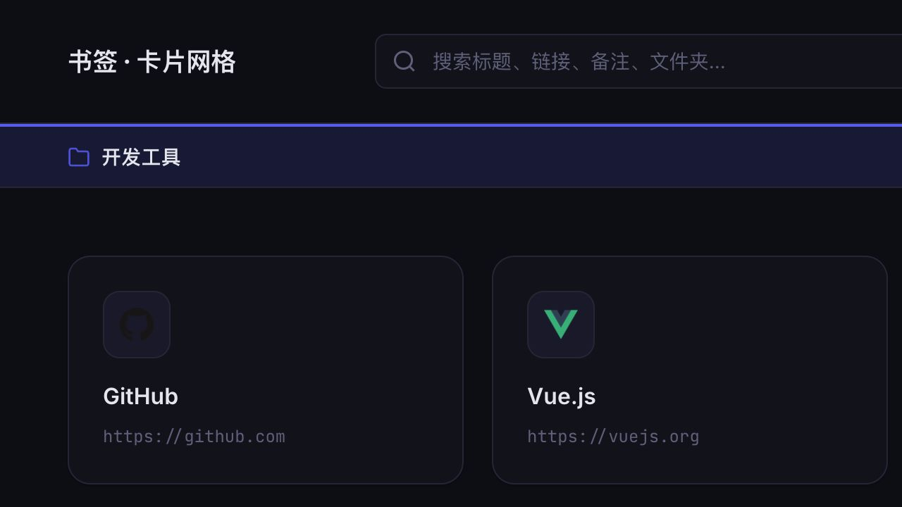

# Bookmarks Manager

A simple and easy-to-use bookmark management tool built with Go backend and Vue.js frontend.


## Application screenshot



## Features

- 📁 **Folder Management** - Create, edit, delete folders with nested structure support
- 🔖 **Bookmark Management** - Add, edit, delete bookmarks with batch operations
- 🔄 **Drag & Drop** - Reorder folders and bookmarks with drag-and-drop
- 📦 **Batch Operations** - Select, delete and move bookmarks in batches
- 🌐 **Metadata Fetching** - Auto-fetch webpage titles and favicon icons
- 🎨 **Modern UI** - Clean and beautiful user interface
- 📱 **Responsive Design** - Adapts to different screen sizes
- ⚡ **Fast Performance** - SQLite-based local database for quick queries
- 🔒 **Secure & Reliable** - Supports intranet HTTPS sites

## Multi-user isolation, permissions, and public bookmarks

The application supports multiple accounts in one instance, including deployments on a family NAS. Bookmark data and most account settings are logically isolated by user ID in the same SQLite database; each user does not get a separate database file.

| Topic | Current behavior |
| --- | --- |
| Folders, bookmarks, and ordering | Isolated for normal user APIs. Queries and mutations are scoped to the authenticated user's `user_id`. |
| Theme, background, and layout settings | Mixed. Display options, items per row, default homepage, folder-view scale, and desktop background are stored in per-user configuration. Some theme, mobile view/background, and template-sort preferences still use browser `localStorage`, so they may carry over when switching accounts in the same browser. |
| Browser extension sync | Scoped to the user that owns the `X-API-Key`. Do not share an API key between accounts. |
| Administrator access | Administrators can view, edit, delete, reorder, pre-create, and export another user's bookmark data through the protected admin APIs. |
| No-login mode | A request without a valid token is mapped to the first active administrator account. All anonymous visitors therefore use the same administrator data. A valid token still selects that user's own data. |

The current release supports public bookmarks through `public` visibility, `/public-bookmarks.html`, and `/api/public-tree`. It does not yet provide a shared-folder model: folders are still owned by one user, there is no per-folder collaboration permission, and there is no one-click “copy public bookmark to my collection” action. Administrators can pre-create copies for individual users, but that is not a single shared public collection. Shared folders, a maintained public collection, and copy-to-own-collection workflows remain future features.

## Technical Architecture

### Backend Stack
- **Go 1.21+** - Primary programming language
- **Chi** - Lightweight HTTP router
- **SQLite** - Local database storage
- **Go Modules** - Dependency management

### Frontend Stack
- **Vue.js 3** - Modern JavaScript framework
- **HTML5/CSS3** - Page layout and styling
- **Fetch API** - HTTP request handling

### Data Storage
- SQLite database file: `data.db`
- Foreign key constraints and data consistency
- Automatic position maintenance

## Quick Start

### System Requirements
- Go 1.21 or higher
- SQLite-supported operating system (Windows/macOS/Linux)

### Installation Steps

1. **Clone or download the project**
   ```bash
   git clone <project-url>
   cd bookmarks
   ```

2. **Run the application**
   ```bash
   go run main.go
   ```
   
   **Configuration options:**
   - Custom port: `go run main.go -port 3000`
   - Custom data path: `go run main.go -dataUrl=/path/to/your/data/`
   - Combined configuration: `go run main.go -dataUrl=/path/to/data -port 8080`
   - View all options: `go run main.go -h`

3. **Access the application**
   - Default address: http://localhost:8901
   - Or visit your specified port address

### Configuration Options

You can customize the bookmark manager via command line parameters:

**Available Parameters:**
- `-dataUrl`: Data storage path (default: "./")
- `-port`: Server listening port (default: "8901")

**Examples:**
```bash
# Custom data path
go run main.go -dataUrl=/path/to/your/data/

# Custom port
go run main.go -port 3000

# Combined configuration
go run main.go -dataUrl=/path/to/data -port 8080

# View all options
go run main.go -h
```

## Usage Guide

### Basic Operations

1. **Create Folders**
   - Click "New Folder" button on the left panel
   - Or right-click existing folder and select "New Subfolder"

2. **Add Bookmarks**
   - Click "Add URL" button on the left panel
   - Or right-click folder and select "Add URL"
   - Enter URL and click "Fetch Info" to auto-fill title and icon

3. **Edit Items**
   - Double-click folder or bookmark name to edit
   - Or right-click and select "Edit" option

4. **Delete Items**
   - Right-click and select "Delete" option
   - Or use batch deletion in edit mode

### Advanced Features

1. **Reordering**
   - Drag folders or bookmarks to new positions
   - Or use "Move Up"/"Move Down" options in right-click menu

2. **Move to Folder**
   - Right-click and select "Move to Folder"
   - Select target folder and confirm

3. **Batch Operations**
   - Click "Edit" button to enter edit mode
   - Use checkboxes to select multiple items
   - Execute batch delete or move operations

4. **Search and Organization**
   - Organize bookmarks through folder structure
   - View bookmark path information

### Keyboard Shortcuts

- **Right-click Menu**: Right-click any item to see available operations
- **Double-click Edit**: Double-click item name for quick editing
- **Drag & Drop**: Directly drag to target position
- **Batch Selection**: Use edit mode for batch operations

## API Documentation

### RESTful API Endpoints

- `GET /api/tree` - Get complete tree structure
- `GET /api/metadata?url=<url>` - Fetch webpage metadata
- `POST /api/folders` - Create folder
- `POST /api/bookmarks` - Create bookmark
- `PUT /api/nodes/{id}` - Update node
- `DELETE /api/nodes/{id}` - Delete node
- `POST /api/nodes/reorder` - Reorder nodes

### Request Examples

```bash
# Get tree structure
curl http://localhost:8901/api/tree

# Create folder
curl -X POST http://localhost:8901/api/folders \
  -H "Content-Type: application/json" \
  -d '{"title":"Work Related","parent_id":null}'

# Create bookmark
curl -X POST http://localhost:8901/api/bookmarks \
  -H "Content-Type: application/json" \
  -d '{"title":"GitHub","url":"https://github.com","parent_id":1}'
```

## Configuration

### Database Configuration
- Database file location: configurable via `-dataUrl` parameter
- Default location: `data.db` in current directory
- Automatically creates necessary tables and indexes

### Server Configuration
- Default port: 8901
- Static file serving support
- Built-in CORS support

## Project Structure

```
bookmarks/
├── main.go              # Main program entry point
├── go.mod               # Go module definition
├── go.sum               # Dependency checksums
├── data.db              # SQLite database file (generated at runtime)
├── static/              # Static files directory
│   ├── index.html       # Main page
│   ├── app.js          # Vue.js application
│   └── style.css       # Style sheet
├── README.md           # Chinese documentation
├── README.en.md        # English documentation
└── techfunway.bookmarks/ # Packaging related files
```

## Development

### Environment Requirements
- Go 1.21+
- Modern browser support (Chrome, Firefox, Safari, Edge)

### Development Run
```bash
# Start development server
go run main.go

# After modifying frontend code, refresh browser to see changes
```

### Deployment Recommendations
- Can be packaged as single executable file
- Runs on any platform supporting Go
- Data files can be separated from program for easy backup

## Troubleshooting

### Common Issues

1. **Port Already in Use**
   - Check if port 8901 is occupied by other programs
   - Or modify port configuration in code

2. **Database Errors**
   - Ensure write permissions
   - Check if disk space is sufficient

3. **Metadata Fetching Failures**
   - Check network connection
   - Some websites may restrict crawler access

4. **HTTPS Site Access Failures**
   - Application supports self-signed certificates
   - Intranet HTTPS sites can be accessed normally

### Log Viewing
- Server startup shows running port
- Browser developer tools for frontend errors
- Server logs show API requests and error information

## License

This project uses the MIT License, see LICENSE file for details.

## Contributing

Issues and Pull Requests are welcome!

1. Fork the repository
2. Create feature branch (`git checkout -b feature/AmazingFeature`)
3. Commit changes (`git commit -m 'Add some AmazingFeature'`)
4. Push to branch (`git push origin feature/AmazingFeature`)
5. Open Pull Request

## Changelog

### v1.0.0
- Initial release
- Basic folder and bookmark management
- Drag & drop reordering support
- Batch operations functionality
- Webpage metadata fetching
